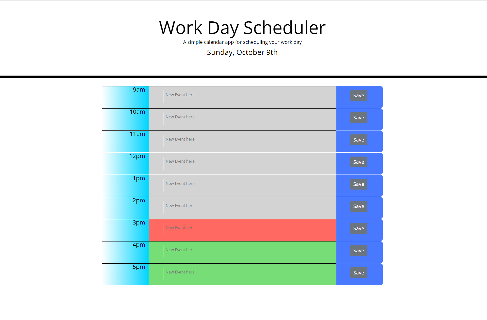

# Work-Day-Scheduler

## Description

 This website application is used to show how I could intergrate moment.js, jQuery and local storage into an everyday scheduler with the help of bootstrap.

 The scheduler updates various hour segments with a color layout dependent on the time of day. "Events" can be saved to each hour segment which is saved to local storage and also pulled from storage when page is loaded.

## Usage

Deployed application:  
https://biscuit231.github.io/Work-Day-Scheduler/

## Credits

jQuery:
https://jquery.com/

Moment.js:
https://momentjs.com/

My Github:  
https://github.com/biscuit231/

Readme guide:  
https://coding-boot-camp.github.io/full-stack/github/professional-readme-guide

## License

MIT License